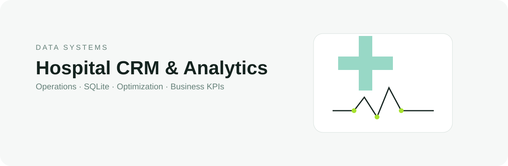

<p align="center">
  
</p>

<p align="center">
  
  
  
  
</p>

## Overview

A terminal-based hospital CRM that connects operational workflows, a relational SQLite database, optimization algorithms, and analytical KPIs in one Python application.

## Product flow

```text
patients & leads → appointments → operational database → analysis → CRM KPIs
```

## Core capabilities

| Operations | Data & algorithms |
|---|---|
| Patient, lead and appointment management | Relational model with 12 connected tables |
| Medical schedules and procedures | Recursive duplicate detection and memoization |
| Quotes, support and pre-surgical checklist | Backtracking-based schedule optimization |
| Status tracking across the care funnel | Exploratory charts and business KPIs |

## Analytics layer

The system uses its own SQLite data to calculate:

- lead conversion rate;
- attendance, absence and cancellation rates;
- top procedures;
- appointment volume by physician;
- lead origin and funnel status;
- patient BMI distribution.

Charts are exported as `analise_exploratoria.png` and `kpis_crm.png` when sufficient data is available.

## Architecture

- `hospital.py` — application menus, business rules, dynamic programming and analytics.
- `db.py` — schema, database connection and shared queries.
- `paciente.py` — patient operations.
- `exceptions.py` — domain-specific validation errors.
- `hospital.db` — local SQLite database used by the application.

## Run

```bash
pip install pandas matplotlib seaborn
python hospital.py
```

Academic team project developed for FIAP. Contributors are preserved in the repository history and original project documentation.

<p align="center"><sub>Data systems · CRM analytics · operational optimization</sub></p>
